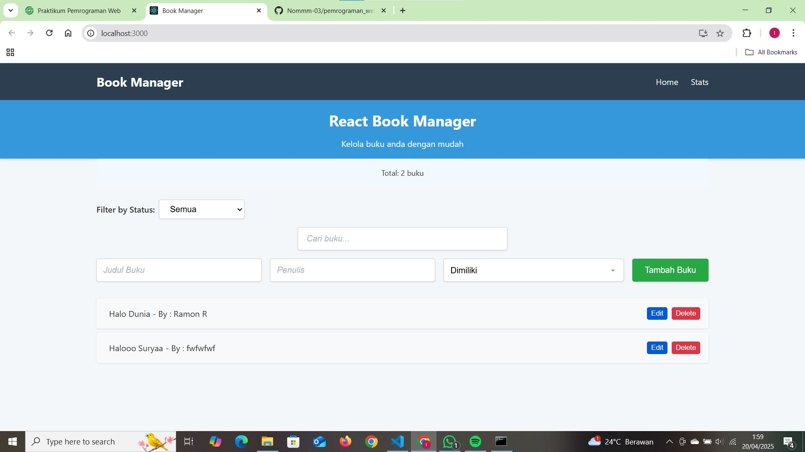
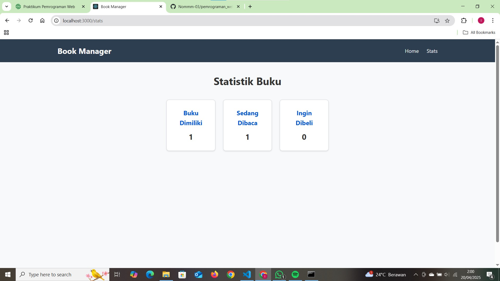
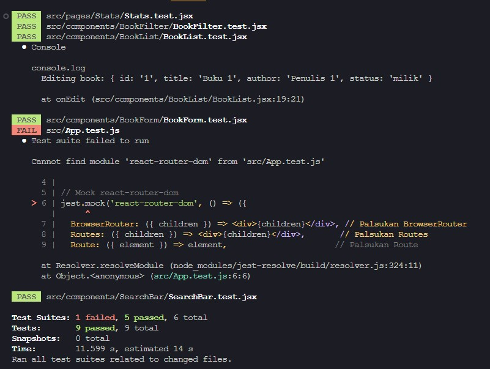

# Aplikasi Manajemen Buku Pribadi

Aplikasi ini adalah aplikasi manajemen buku pribadi yang memungkinkan pengguna mencatat buku-buku yang dimiliki, sedang dibaca, atau ingin dibeli. Dengan fitur ini, pengguna dapat dengan mudah mengelola koleksi buku mereka.

---

## **Deskripsi Aplikasi**

Aplikasi ini dirancang untuk membantu pengguna mengatur daftar buku pribadi mereka. Fitur utama aplikasi meliputi:
- **Menambahkan Buku Baru:** Pengguna dapat menambahkan buku baru dengan memasukkan judul, penulis, dan status (dimiliki, sedang dibaca, atau ingin dibeli).
- **Mengedit dan Menghapus Buku:** Pengguna dapat mengedit detail buku atau menghapusnya dari daftar.
- **Filter Buku Berdasarkan Status:** Pengguna dapat memfilter buku berdasarkan status tertentu.
- **Pencarian Buku:** Pengguna dapat mencari buku berdasarkan judul atau penulis.
- **Statistik Buku:** Menampilkan statistik jumlah buku berdasarkan status.

Data buku disimpan secara lokal menggunakan `localStorage`, sehingga data tetap tersedia meskipun halaman direfresh.

---

## **Instruksi Instalasi dan Menjalankan**

### **Prasyarat**
Pastikan Anda sudah menginstal [Node.js](https://nodejs.org/) di sistem Anda.

### **Langkah-Langkah**

1. **Clone Repository**
   ```bash
   git clone https://github.com/Nommm-03/pemrograman_web_itera_122140078.git
   cd pemrograman_web_itera_122140078
	 cd ramonriping_122140078_pertemuan3

2. **Instal Depedensi**
   ```bash
   npm install
	 # atau
	 yarn install

3. **Menjalankan Aplikasi**
   ```bash
	 npm start
	 # atau
   yarn start

	 Aplikasi ini akan berjalan di browser pada alamat http://localhost:3000.

4. **Menjalankan Test**
   Untuk menjalankan test suite
	 ```bash
	 npm test
	 # atau
	 yarn test

### **Screenshot Antarmuka**
Berikut adalah beberapa screenshot dari aplikasi :

**Halaman Utama (Home)**

Halaman utama menampilkan daftar buku beserta tombol aksi untuk mencari, menambahkan, mengedit dan menghapus buku.

**Halaman Statistik (Stats)**

Halaman statistik menampilkan jumlah buku berdasarkan status (dimiliki, sedang dibaca, ingin dibeli).

### **Penjelasan Fitur React yang Digunakan**

1. **Functional Components dan Hooks**
   - Semua komponen dibuat menggunakan functional components.
   - Menggunakan hooks seperti `useState`, `useEffect`, dan custom hooks (`useLocalStorage` dan `useBookStats`) untuk mengelola state dan efek samping.

2. **State Management dengan Context API**
   - Menggunakan Context API untuk menyimpan daftar buku dan fungsi-fungsinya agar dapat diakses oleh semua komponen tanpa prop drilling.

3. **React Router**
   - Menggunakan `react-router-dom` untuk navigasi multi-halaman (misalnya halaman `Home` dan `Stats`).

4. **Custom Hooks**
   - `useLocalStorage`: Untuk menyimpan data ke `localStorage`.
   - `useBookStats`: Untuk menghitung statistik buku berdasarkan status.

5. **PropTypes**
   - Menggunakan `PropTypes` untuk memvalidasi props di komponen-komponen utama.

6. **Testing**
   - Menggunakan React Testing Library untuk membuat unit test.
   - Minimal 5 test case telah diimplementasikan untuk memastikan fungsionalitas aplikasi.

7. **Error Handling**
   - Menampilkan pesan error langsung di UI jika input form kosong, menggantikan penggunaan `alert()`.

8. **Reusable Components**
   - Komponen seperti `BookForm`, `BookList`, dan `BookFilter` dirancang untuk reusable.

---

## **Laporan Testing**

Berikut adalah hasil test suite:



- **Test Case 1:** Memastikan statistik buku dihitung dengan benar.
- **Test Case 2:** Memastikan filter buku berfungsi dengan benar.
- **Test Case 3:** Memastikan informasi buku dapat ditampilkan secara lengkap beserta dengan tombol aksinya.
- **Test Case 4:** Memastikan form menampilkan pesan error jika input kosong.
- **Test Case 5:** Memastikan routing antar halaman berfungsi dengan baik. Akan tetapi, file testing menyatakan gagal dikarenakan jest tidak mengenal react-router-dom.
- **Test Case 6:** Memastikan pencarian buku berfungsi dengan benar.

---